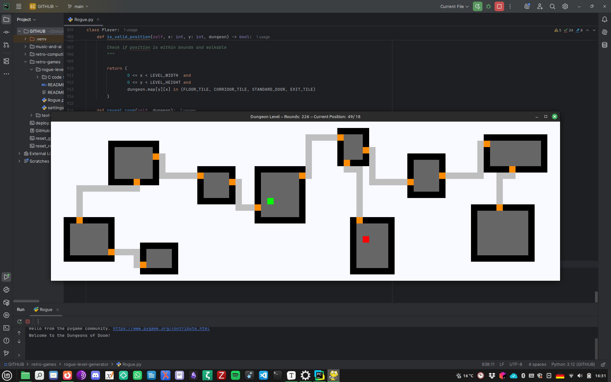
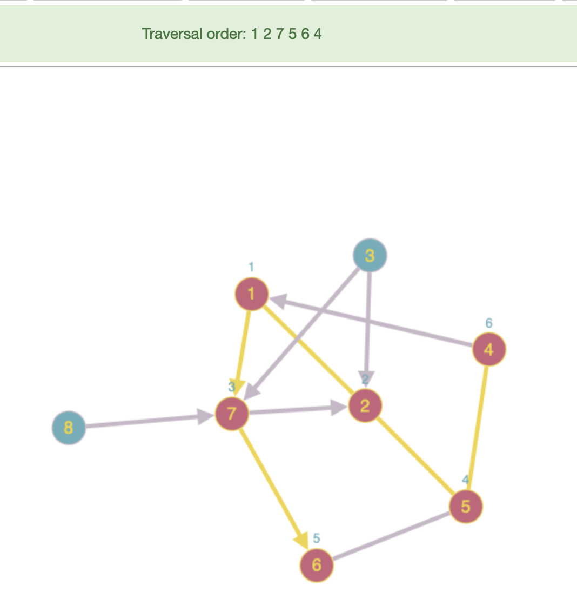
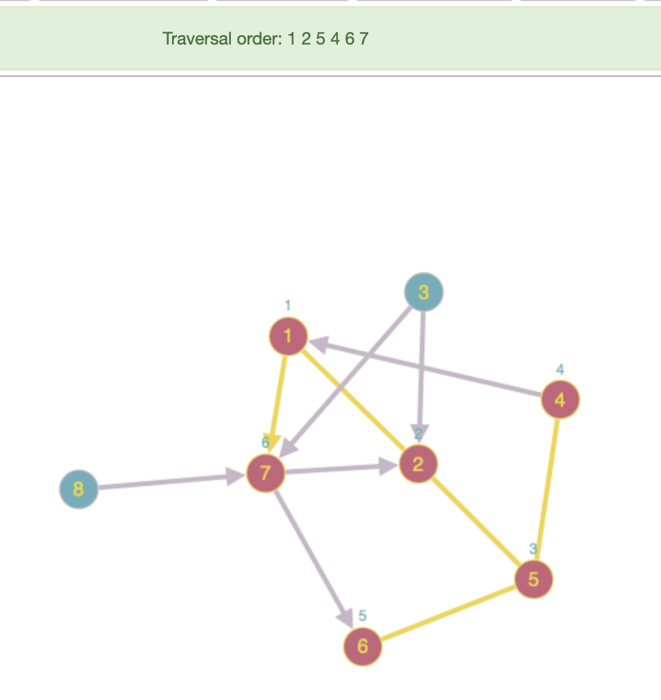

# Rogue Dungeon Generator

## Procedural ASCII and Pygame Level Generator

Right now, this is mostly a map generator that will build dungeons of connected rooms and corridors, similar to in the 1980 ASCII game "Rogue." I wrote it both as an exercise in game design, as my first experiment with PyGame, and as a fun playground to get into network and graph theory.

Maps consist of rectangular rooms and connecting corridors. They are placed within a grid of 80 x 25 tiles.
- Rooms are rectangular, and may not overlap (including a buffer area).
- Corridors always end in doors, connecting the rooms in a maze.
- Corridors never cross rooms, so there are algorithms to avoid such cases.

After generating, the complete dungeon level and information about the rooms and corridors are stored in variables. The dungeon level is then shown on the screen as an ASCII representation.

More on "Rogue"'s history on

+ _Wikipedia_, https://en.wikipedia.org/wiki/Rogue_(video_game);
+ Michael C. Toy and Kenneth Arnold, "A Guide to the Dungeons of Doom", https://docs-archive.freebsd.org/44doc/usd/30.rogue/paper.pdf;
+ David Craddock, _Dungeon Hacks: How Nethack, Angband, and Other Roguelikes Changed the Course of Video Games_, Boca Raton 2021;
+ Matt Barton, _Dungeons & Desktops: The History of Computer Role-Playing Games_, 2nd ed., Boca Raton 2019.

Maybe these two books are useful as well, but I did not have a look:

+ _Procedural Content Creation in Games_, ed. Noor Shaker, Julian Togelius, and
+ Mark J. Nelson; _Procedural Generation in Game Design_, ed. Tanya Short,Tarn Adams.

There seems to be a book on more sophisticated AI generation methods as well, written by

+ Julian Togelius: _Artificial Intelligence and Games_.

And there is quite a lot of articles dealing with new algorithms for the procedural generation of dungeon levels, so this seems to be a small research trend in its own right.

Basically, rooms and corridors form a graph or network of nodes and edges in this miniature implementation. I use standard MST (Minimum-Spanning Tree) and BFS (Breadth-First Search) algorithms to calculate the corridors: https://en.wikipedia.org/wiki/Breadth-first_search and https://en.wikipedia.org/wiki/Minimum_spanning_tree. Other possible pathfinding algorithms would be Dijkstra and A*. Implementing them and randomly picking different algorithms during the generation process might result in more diverse dungeon layouts. Confer:

+ Reema Thareja, _Data Structures Using C_, 2nd ed., Oxford etc. 2014, pp. 409-413 (MST) and pp. 394-397
+ Ellis Horowitz, Sartaj Sahni and Susan Anderson-Freed, _Grundlagen von Datenstrukturen in C_ (_Fundamentals of Data Structures in C_, New York 1993), Bonn 1994, pp. 280f. (BFS)
+ Fotis Jannidis, "Netzwerke", in: _Digital Humanities. Eine Einführung_, ed. Fotis Jannidis, Hubertus Kohle, and Malte Rehbein, Stuttgart 2017, pp. 147-161

I have implemented the two algorithms as Python translations of C code from the above books; and I included my own C translation in a subfolder. The double-ended queue is not newly programmed but included by "from collections import deque".

However, it seems that I could also "import networkx", where they are predefined and can be used by
- networkx.minimum_spanning_tree(graph, algorithm="kruskal") <- MST
- networkx.bfs_edges(graph, source) <- BFS

Another MST algorithm working with adjacency matrices would be predefined in

- scipy.sparse.csgraph.minimum_spanning_tree(matrix)

I guess using these pre-defined implementations would enhance the speed.

"My" dungeons actually look somewhat better than what I remember from 1980s free "Hack" implementations for the
Commodore AMIGA with 256 / 512 KByte of memory. I guess this is due to the slightly more modern and memory-intensive
algorithms that I can use. "Hack" corridors were sometimes mostly straight lines, they sometimes led to corners of
rooms, and door placements were often rather awkward.

Gameplay elements contained in this code:
- A player representation can be moved freely across the dungeon.
- There's an elementary visibility system implemented.

Further gameplay elements might be:
- opponents / monsters,
- items,
- an RPG / fighting system, and so on.

This would possibly at least require additional classes Monster, Item (with subclasses).

You can choose between the old-school ASCII output and a pseudo-graphics mode using pygame. Gameplay mechanics are available in the pygame version, while the ASCII gives a test output of the level blueprint.

All I know about pygame so far (which is not much) is stolen from this book:

+ Al Sweigert, "Invent Your Own Computer Games with Python", 4th ed., San Francisco 2017, pp. 255-272.

---

### CURRENT STRUCTURE

I re-organized all functions into classes:
- There are currently classes for "Room"s, "Door"s, and "Corridor"s to generate the level data.
- For the actual gameplay, there is a rudimentary class "Player".
- Then there are additional classes for
                                    - Dungeon (control logic) and
                                    - Utilities (random stuff that didn't fit anywhere else).
                                    
- Last, I added the DungeonVisualizer class for ASCII and pygame output.

It looks ridiculously over-organized now, and I might need to split the code into several modules.

---

### WHAT IT LOOKS LIKE

---

### NEXT IDEAS

+  Implement a sight system: mostly done.

  One last addition might be that, rooms might be dark: in this case only the walls would stay visible after the room has been visited, but the floor cells would behave like corridors (and vanish once the player leaves them).

+ Implement an NPC class

  Monsters might have a x,y position plus an follow flag:
  if follow is False, they should move randomly
  if follow is True, they should approach the player with a suitable algorithm (Dijkstra or A*)
  The algorithms are predifned in networkx and pathfinding. (A* ist faster, Dijkstra is easier to implement.)

  Further, monsters should have a speed (move each round or every other round), and a cooldown value for unfollowing.

  follow gets True once PC and NPC can see each other (are in the same room or in adjacent corridors)
  follow gets False once they cannot see each other for n moves (n might be defined in the NPC class)

---

### C CODE

The C code implments BFS and DFS. The graphs look like this:

_BFS graph_

_DFS graph:_

---

christoph.hust@hmt-leipzig.de